# NoDiscordFluffTheme

A collection of basic css "themes" which remove buttons for annoying or cluttering Discord functions (things like the nitro button in the message bar).

## How to use

These files were made for use with the Vencord custom Discord client. They can likely be used with other custom clients but this hasn't been tested.

For each of the features you would like, open the Vencord settings page and navigate to the "Themes" tab.

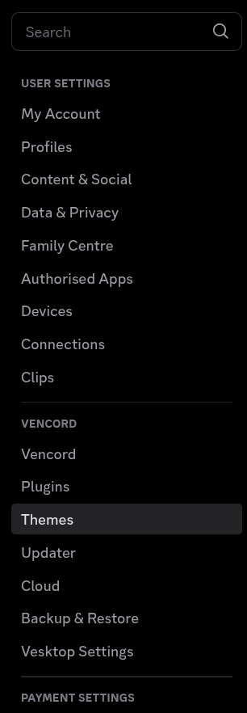

On the Themes page, navigate to the "Online Themes" tab at the top of the screen.

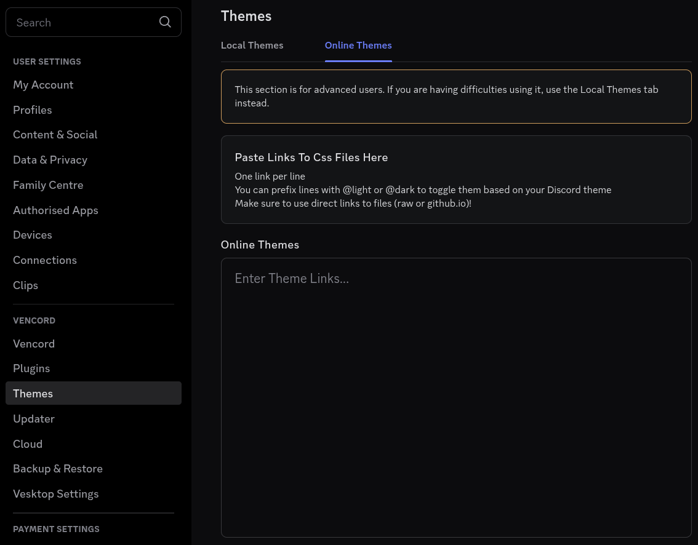

In the box titled "Online Themes", paste in the raw github links for the features you would like to enable.

## Available Features

### Remove Nitro Shop From Friends List

Before:
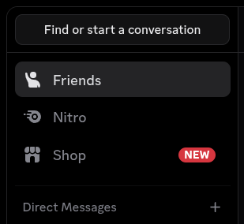

After:
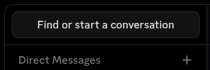

To enable, paste the following link into the "Online Themes" box in the Vencord "Themes" settings.

`https://raw.githubusercontent.com/CovenEsme/NoDiscordFluffTheme/refs/heads/main/RemoveNitroShopFromFriendsList.css`

### Remove Server Boosts From Channel List

Before:
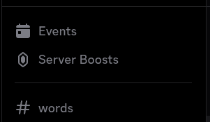

After:
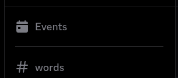

To enable, paste the following link into the "Online Themes" box in the Vencord "Themes" settings.

`https://raw.githubusercontent.com/CovenEsme/NoDiscordFluffTheme/refs/heads/main/RemoveServerBoostsFromChannelList.css`

### Remove Server Boosts Progress Bar

Before:
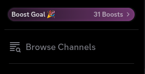

After:
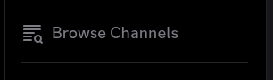

To enable, paste the following link into the "Online Themes" box in the Vencord "Themes" settings.

`https://raw.githubusercontent.com/CovenEsme/NoDiscordFluffTheme/refs/heads/main/RemoveServerBoostsProgressBar.css`

### Remove Nitro From Message Bar

Before:
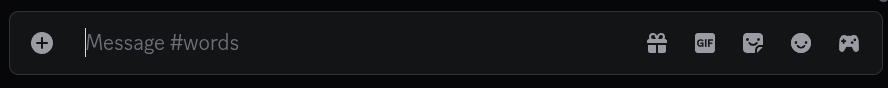

After:
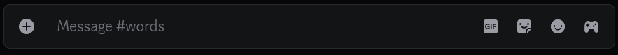

To enable, paste the following link into the "Online Themes" box in the Vencord "Themes" settings.

`https://raw.githubusercontent.com/CovenEsme/NoDiscordFluffTheme/refs/heads/main/RemoveNitroFromMsgBar.css`

### Remove GIFs From Message Bar

Before:

After:
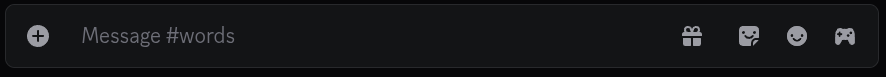

To enable, paste the following link into the "Online Themes" box in the Vencord "Themes" settings.

`https://raw.githubusercontent.com/CovenEsme/NoDiscordFluffTheme/refs/heads/main/RemoveGifsFromMsgBar.css`

### Remove Stickers From Message Bar

Before:

After:
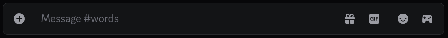

To enable, paste the following link into the "Online Themes" box in the Vencord "Themes" settings.

`https://raw.githubusercontent.com/CovenEsme/NoDiscordFluffTheme/refs/heads/main/RemoveStickersFromMsgBar.css`

### Remove Emotes From Message Bar

Before:

After:
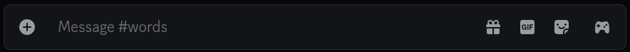

To enable, paste the following link into the "Online Themes" box in the Vencord "Themes" settings.

`https://raw.githubusercontent.com/CovenEsme/NoDiscordFluffTheme/refs/heads/main/RemoveEmotesFromMsgBar.css`

### Remove App Games From Message Bar

Before:

After:
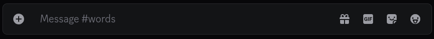

To enable, paste the following link into the "Online Themes" box in the Vencord "Themes" settings.

`https://raw.githubusercontent.com/CovenEsme/NoDiscordFluffTheme/refs/heads/main/RemoveAppGamesFromMsgBar.css`

### Fix Message Bar Padding

Before:
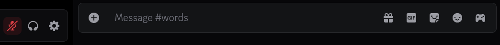

After:
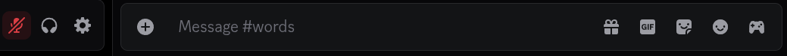

This does make the "[user] is typing..." text clip into the message bar.

To enable, paste the following link into the "Online Themes" box in the Vencord "Themes" settings.

`https://raw.githubusercontent.com/CovenEsme/NoDiscordFluffTheme/refs/heads/main/FixMsgBarPadding.css`
